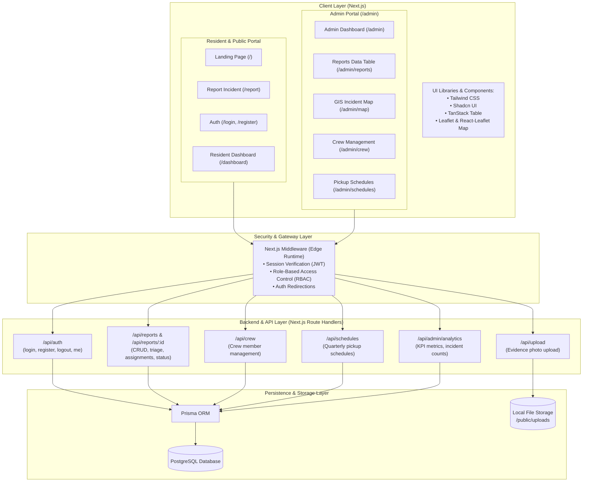
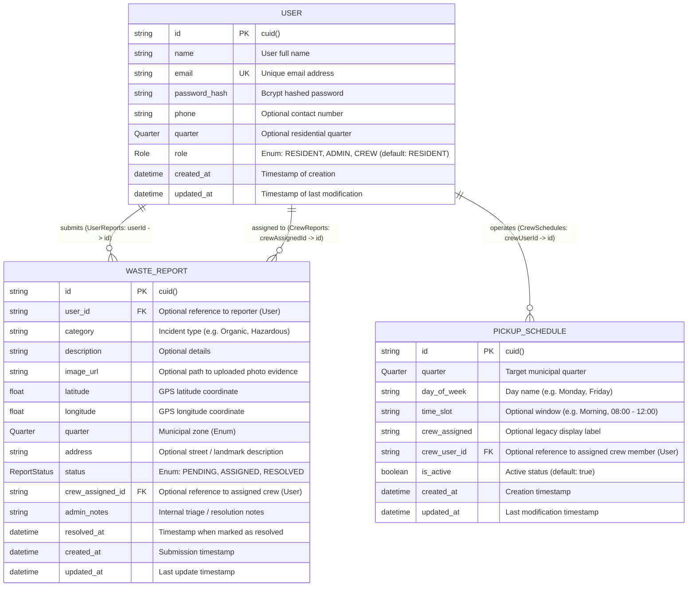

# System Architecture & Database ER Diagrams

This document details the architectural layout, component boundaries, and database entity-relationship schema for the **Waste Management System**.

---

## 1. System Architecture Diagram

### Architectural Breakdown

| Layer                     | Technologies                                                                                                          | Responsibilities                                                                                                                                                                                                        |
| :------------------------ | :-------------------------------------------------------------------------------------------------------------------- | :---------------------------------------------------------------------------------------------------------------------------------------------------------------------------------------------------------------------- |
| **Client / Presentation** | Next.js 16 App Router, React 19, Tailwind CSS v4, Lucide Icons, Shadcn UI / Base UI, Leaflet, TanStack React Table v8 | Provides responsive user interfaces for residents to file reports and track updates, as well as an administrative command center for incident triage, mapping, crew allocation, and schedule planning.                  |
| **Security & Routing**    | Next.js Middleware (`proxy.ts`), `jose`, `jsonwebtoken`                                                               | Intercepts incoming requests to validate authentication cookies/JWT tokens, enforces role-based access rules (e.g. restricting `/admin/*` to `ADMIN` roles), and handles automatic redirection for authenticated users. |
| **Backend API Services**  | Next.js Route Handlers (`app/api/*`)                                                                                  | Serves modular RESTful API endpoints handling authentication, report CRUD, multipart image uploads, crew management, schedules, and analytics aggregations.                                                             |
| **Persistence & Storage** | PostgreSQL, Prisma ORM, Local Disk (`/public/uploads`)                                                                | Handles structured relation storage with strict schema constraints, foreign key referential integrity, and local file storage for photo evidence.                                                                       |

---

## 2. Entity-Relationship (ER) Diagram

---

## 3. Schema Reference & Enums

### Enums

#### `Role`

Defines authorization levels across the system:

- `RESIDENT`: Standard citizen account. Can submit reports with geolocation and photos, and track submitted incident statuses in their dashboard.
- `CREW`: Field team member dispatched to inspect, collect, and resolve reported incidents.
- `ADMIN`: Municipal supervisor with full privileges across reports, GIS maps, crew management, schedules, and analytics.

#### `Quarter`

Defines administrative municipal zones for targeted waste management:

- `URO`
- `OKE_OSUN`
- `ODO_OJA`
- `OGBONTIORO`
- `OLOWO_IJESA`

#### `ReportStatus`

Tracks the lifecycle of an incident:

- `PENDING`: Newly submitted incident awaiting triage by administrators.
- `ASSIGNED`: Incident verified and assigned to a sanitation crew member for pickup.
- `RESOLVED`: Waste collected, site cleared, and issue closed.

---

## 4. Key Relational Connections

1. **User as Reporter vs. Dispatched Crew Member**:
   - `User.reports` (`UserReports`): One-to-many relationship linking a resident to all incident reports they have submitted (`onDelete: SetNull`).
   - `User.assignedTasks` (`CrewReports`): One-to-many relationship linking a crew member (`Role = CREW`) to incidents dispatched to them for remediation (`onDelete: SetNull`).

2. **Pickup Route Assignments**:
   - `User.schedules` (`CrewSchedules`): One-to-many relationship linking a crew member to regular waste collection schedules assigned to their municipal quarter (`onDelete: SetNull`).
